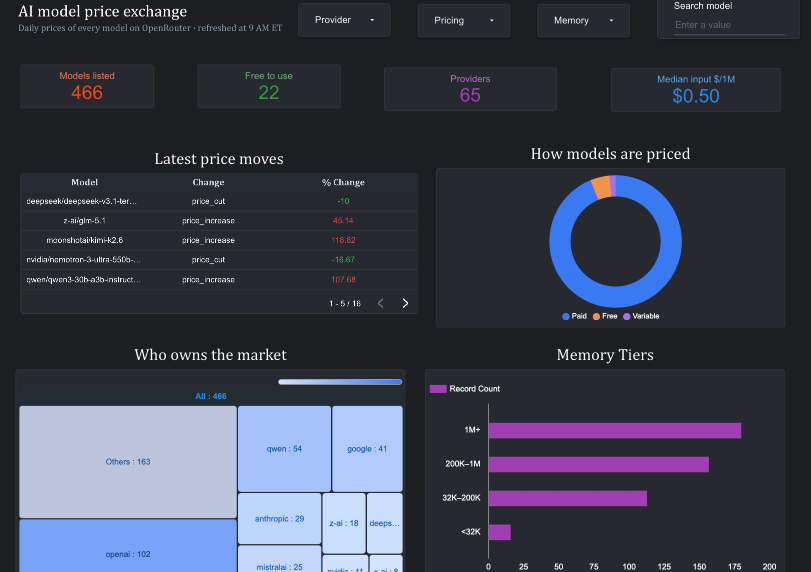
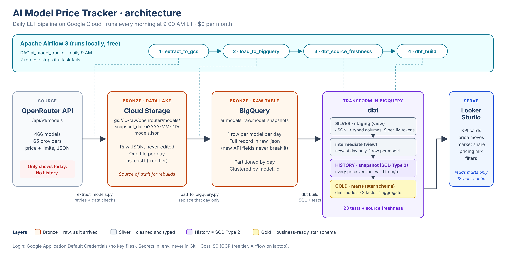

# AI Model Price Tracker

A daily, automated data pipeline on Google Cloud that tracks the price and capabilities of **every AI model on OpenRouter** (466 models from 65 providers), keeps a full **price history**, and shows it in a live dashboard.



**Live dashboard:** https://datastudio.google.com/u/0/reporting/6df2d2d3-4183-4f4a-8cd4-3993bf1066fb/page/K4QAG

---

## The problem

AI model prices change constantly. Providers cut prices, raise them, and launch new models every week. But the OpenRouter API only shows **today's** prices. It keeps no history, so once a price changes, the old price is gone.

That makes simple questions impossible to answer:

- Which models got cheaper this week, and by how much?
- Who are the biggest providers, and how many models are free?
- What did a model cost two weeks ago?

## The solution

A pipeline that takes a snapshot of the whole AI model market every day, stores the raw data, cleans it with dbt, records every price change as **SCD Type 2 history**, and serves it to a dashboard.

| Result | Number |
|---|---|
| Models tracked per day | 466 |
| Providers | 65 |
| Free models | 22 |
| Median input price (paid models) | $0.50 per 1M tokens |
| Real price changes caught in the first days | 16 (biggest: +118.8% and −16.7%) |
| dbt models, snapshot and tests per run | 30, all passing |
| Data quality tests | 23 |
| Raw data per day | under 1 MB |
| Monthly cost | **$0** (GCP free tier) |

---

## Architecture



```
OpenRouter API ─► Cloud Storage ─► BigQuery raw ─► dbt (staging → snapshot → marts) ─► Looker Studio
   (JSON)          (bronze)         (bronze)         (silver → history → gold)          (dashboard)

Airflow, daily 9 AM ET:  extract_to_gcs → load_to_bigquery → dbt_source_freshness → dbt_build
```

### Layers

| Layer | Where | What it holds |
|---|---|---|
| **Raw files (bronze)** | Cloud Storage `gs://…-raw/openrouter/models/snapshot_date=YYYY-MM-DD/models.json` | The API response exactly as it arrived, one file per day |
| **Raw table (bronze)** | BigQuery `ai_models_raw.model_snapshots` | One row per model per day, full JSON kept in a `raw_json` column. Partitioned by day, clustered by `model_id` |
| **Staging (silver)** | `ai_models.stg_openrouter__models` (view) | JSON parsed into typed columns, prices converted to $ per 1M tokens |
| **Intermediate** | `ai_models.int_openrouter__latest_models` (view) | Only the newest day, one row per model |
| **History** | `ai_models_snapshots.snap_model_pricing` | dbt snapshot (SCD Type 2): every version of each model's price, with valid-from/valid-to dates |
| **Marts (gold)** | `ai_models.dim_models`, `fct_*`, `agg_*` (tables) | Star schema the dashboard reads |

---

## Data model: star schema


| Table | Type | One row per | Answers |
|---|---|---|---|
| `dim_models` | Dimension | Model | What models exist, who makes them, what can they do, what do they cost now? |
| `fct_model_daily_prices` | Fact | Model per day | What did each model cost on each day? |
| `fct_model_price_changes` | Fact | Price change | When did a price change, by how much, up or down? |
| `agg_provider_daily_summary` | Aggregate | Provider per day | How many models, how many free, median and cheapest price? |

The facts join to the dimension on `model_id`. `fct_model_price_changes` is built from the SCD Type 2 snapshot, using `LAG()` to compare each version with the one before it.

---

## Dashboard

Built in Looker Studio on the mart tables only (dark "stock exchange" theme):

- **4 KPI cards:** models listed, free models, providers, median input price
- **Latest price moves:** newest price cuts (green) and increases (red)
- **How models are priced:** paid vs free vs variable pricing
- **Who owns the market:** treemap of models per provider
- **Memory tiers:** models by context window size (1M+, 200K–1M, 32K–200K, <32K)
- **Filters:** provider, pricing, memory tier, and model search

---

## Tech stack

| Purpose | Tool |
|---|---|
| Source | [OpenRouter models API](https://openrouter.ai/api/v1/models) |
| Extract and load | Python (`requests`, `google-cloud-storage`, `google-cloud-bigquery`) |
| Data lake | Google Cloud Storage (us-east1, free tier) |
| Warehouse | BigQuery |
| Transform, test, history | dbt (dbt-core + dbt-bigquery) |
| Orchestration | Apache Airflow 3 (local) |
| Dashboard | Looker Studio |
| Auth | Google Application Default Credentials (no key files) |

---

## Project structure

```
ai-model-tracker/
├── extract/
│   └── extract_models.py          # API → Cloud Storage (retries, data checks)
├── load/
│   └── load_to_bigquery.py        # Cloud Storage → BigQuery raw (idempotent per day)
├── dbt/
│   ├── dbt_project.yml
│   ├── profiles.yml               # oauth login, no secrets
│   ├── models/
│   │   ├── staging/               # sources, stg model, tests
│   │   ├── intermediate/          # latest snapshot per model
│   │   └── marts/                 # dim, facts, aggregate + tests
│   ├── snapshots/
│   │   └── snap_model_pricing.yml # SCD Type 2 price history
│   └── tests/
│       └── assert_no_negative_prices.sql
├── dags/
│   └── ai_model_tracker_dag.py    # Airflow DAG: 4 tasks, daily
├── images/
│   ├── architecture.png
│   ├── star_schema.png
│   └── dashboard.png
├── requirements.txt
├── .env.example
├── .gitignore
└── README.md
```

---

## How to run it

**Prerequisites:** a GCP project with BigQuery enabled, the `gcloud` CLI, Python 3.11+, and a free OpenRouter API key.

```bash
# 1. Clone and install
git clone https://github.com/<your-username>/ai-model-tracker.git
cd ai-model-tracker
python3 -m venv .venv && source .venv/bin/activate
pip install -r requirements.txt

# 2. Log in to Google Cloud (no key file needed)
gcloud auth application-default login
gcloud auth application-default set-quota-project <your-project-id>

# 3. Settings: copy the example and fill in your values
cp .env.example .env

# 4. Create the bucket (us-east1 = free tier) and BigQuery datasets
gcloud storage buckets create gs://<your-project-id>-raw --location=us-east1
bq mk --location=US --dataset <your-project-id>:ai_models_raw
bq mk --location=US --dataset <your-project-id>:ai_models
bq mk --location=US --dataset <your-project-id>:ai_models_snapshots

# 5. Run the pipeline once by hand
python extract/extract_models.py
python load/load_to_bigquery.py
cd dbt && dbt build --profiles-dir . && dbt source freshness --profiles-dir .
```

**Schedule it with Airflow** (in its own environment, so its packages never clash with dbt):

```bash
python3 -m venv ~/airflow-venv && source ~/airflow-venv/bin/activate
pip install "apache-airflow==3.3.2" \
  --constraint "https://raw.githubusercontent.com/apache/airflow/constraints-3.3.2/constraints-3.13.txt"
export AIRFLOW_HOME=~/airflow-ai-tracker
mkdir -p $AIRFLOW_HOME/dags
ln -s "$(pwd)/dags/ai_model_tracker_dag.py" $AIRFLOW_HOME/dags/
airflow standalone          # then open http://localhost:8080 and turn the DAG on
```

---

## Design decisions

- **ELT, not ETL.** The API has no history, so the raw response is saved untouched before any cleaning. If a transformation is wrong, every table can be rebuilt from the raw data.
- **Idempotent by design.** Each day has its own file path and its own BigQuery partition (`table$YYYYMMDD` with `WRITE_TRUNCATE`). Running a day twice gives the same result, never duplicates.
- **Schema drift protection.** The raw table stores each model's full record as JSON text, so a new API field never breaks the load. dbt picks out the fields it needs.
- **Fail loudly.** The extract checks the response (at least 50 models, every model has an ID and pricing) before saving. dbt tests (unique keys, not-null, relationships, accepted values, no negative prices) and a source-freshness check stop the run before bad data reaches the dashboard.
- **SCD Type 2 with the `check` strategy.** The API has no `updated_at`, so dbt compares price and limit columns each day and opens a new version when one changes. Models removed from the API get their row closed (`hard_deletes: invalidate`).
- **Exact prices.** Prices like $0.00000015 per token are parsed as `BIGNUMERIC`, then shown per 1M tokens. OpenRouter's `-1` (variable pricing) becomes `NULL` plus an `is_variable_pricing` flag instead of a fake negative price.
- **Partitioning and clustering.** The raw table and the daily price fact are partitioned by date and clustered by model/provider, so queries read only the days and models they need.
- **Dashboard reads marts only.** Business logic lives in tested dbt models, not in chart formulas.
- **$0 cost.** Cloud Storage in us-east1 (always-free region), BigQuery well under the 1 TB/month query and 10 GB storage free limits, Airflow run locally instead of Cloud Composer, dashboard data cached for 12 hours.

## What I'd do next in production

- Run Airflow on Cloud Composer, or the scripts as Cloud Run jobs triggered by Cloud Scheduler, so it doesn't depend on a laptop being awake.
- Add alerting (email or Slack) when a task fails or a price changes by more than 50%.
- Make `fct_model_daily_prices` incremental once the history grows large.
- Add a `dim_date` table and a `dim_provider` table to make the star schema fuller.
- Add CI that runs `dbt build` on every pull request.

---

Built by **Rashmi Padalkar** · Data: OpenRouter API
